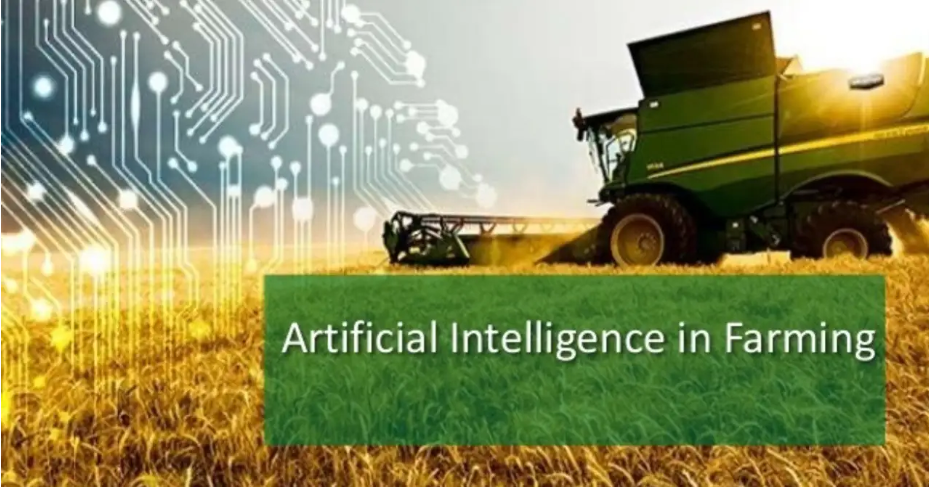

# Project Title

Machine Learning in Agriculture

## Problem Statement

The Toxic Pesticides
Though, many of us don't appreciate much, but a farmer's job is real test of endurance and determination. Once the seeds are sown, he works days and nights to make sure that he cultivates a good harvest at the end of season. A good harvest is ensured by several factors such as availability of water, soil fertility, protecting crops from rodents, timely use of pesticides & other useful chemicals and nature. While a lot of these factors are difficult to control for, the amount and frequency of pesticides is something the farmer can control.

Pesticides are also special, because while they protect the crop with the right dosage. But, if you add more than required, they may spoil the entire harvest. A high level of pesticide can deem the crop dead / unsuitable for consumption among many outcomes. This data is based on crops harvested by various farmers at the end of harvest season. To simplify the problem, you can assume that all other factors like variations in farming techniques have been controlled for.
Now, we want to build a model to predict the chances of Crop damage so that the Farmers can take necessary action.

## Data Definition
Data Description\
Variable	Definition\
ID	=> UniqueID\
Estimated_Insects_Count =>	Estimated insects count per square meter\
Crop_Type =>	Category of Crop(0,1)\
Soil_Type =>	Category of Soil (0,1)\
Pesticide_Use_Category	=> Type of pesticides uses (1- Never, 2-Previously Used, 3-Currently Using)\
Number_Doses_Week =>	Number of doses per week\
Number_Weeks_Used =>	Number of weeks used\
Number_Weeks_Quit =>	Number of weeks quit\
Season =>	Season Category (1,2,3)\
Crop_Damage =>	Crop Damage Category (0=alive, 1=Damage due to other causes, 2=Damage due to Pesticides)
## Language
Python

## Libaries
Numpy\
Pandas\
Matplot\
Seaborn\
sklearn\
neuralnetworks

## Methods Used
Descriptive Statistics\
Inferential Statistics\
Exploratory Data Analysis\
Predictive Analysis\
Machine Learning\
Regression\
Data Visualization\
Predictive Modeling\
Neural networks\
Deep learning\
etc.
## Prerequisites
Domain knowledge on Agriculture, Effects of weather,soiltype,pesticides etc.
